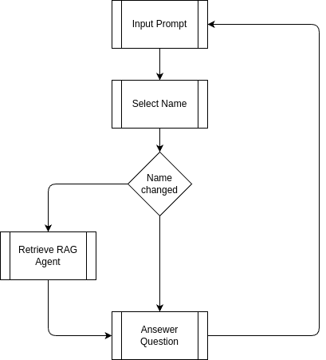

# LLM e IA Generativa - Universidad de Buenos Aires

# ENTREGA 1: RAG Chatbot with Pinecone and Groq

## Overview
This is a **Retrieval-Augmented Generation (RAG) Chatbot** application that integrates:
- **Pinecone** for efficient document retrieval.
- **Groq's LLM** for generating answers based on retrieved context.
- A **Streamlit-based interface** for an interactive and user-friendly chat experience.

The app processes `.odt` documents, indexes them, and uses a combination of retrieval and language modeling to provide accurate, context-aware answers to user queries.

---

## Features
1. **Document Upload & Retrieval**:
   - Reads `.odt` documents from the `docs/` folder.
   - Splits the content into manageable chunks and indexes them in Pinecone.

2. **Conversational Chat Interface**:
   - Displays questions and answers in a chat-like format.
   - Maintains chat history to provide continuity in conversations.

3. **Retrieval-Augmented Generation (RAG)**:
   - Retrieves relevant context from the indexed documents using Pinecone.
   - Generates answers via Groq's LLM by incorporating retrieved context and chat history.

---

# ENTREGA 2: Agent based RAG for multiple CV's


## Overview
In this delivery, we extend the RAG Chatbot to handle multiple CVs using an agent-based approach. Each CV is treated as a separate agent, allowing for more organized and efficient retrieval and generation of answers.

## Features
1. **Multiple CV Management**:
   - Reads CV documents from the `entrega_2/docs/` folder.
   - Initializes a separate agent for each CV, each with its own indexed database in Pinecone.

2. **Agent-Based Retrieval and Generation**:
   - Each agent retrieves relevant context from its respective CV using Pinecone.
   - Generates answers using Groq's LLM based on the retrieved context.

3. **Interactive Streamlit Interface**:
   - Allows users to select a CV from a sidebar dropdown.
   - Provides a chat interface to ask questions and receive answers based on the selected CV.
   - Maintains chat history for each CV to ensure continuity in conversations.

## How to Use
1. **Upload CVs**:
   - Place the CV documents in the `entrega_2/docs/` folder.

2. **Run the Streamlit App**:
   - Execute the Streamlit app to start the chatbot interface.
   - Select a CV from the sidebar and start asking questions.

3. **Ask Questions**:
   - Type your question in the input box and click "Send".
   - The chatbot will retrieve relevant information from the selected CV and generate an answer.

---

# Requirements
### Prerequisites
- **Python 3.9+**
- API keys:
  - Pinecone API Key
  - Groq API Key

### Install Required Packages
Use the following command to install the dependencies:
```bash
pip install -r requirements.txt
```


---
# Requirements
### Prerequisites
- **Python 3.9+**
- API keys:
  - Pinecone API Key
  - Groq API Key

### Install Required Packages
Use the following command to install the dependencies:
```bash
pip install requirements.txt
